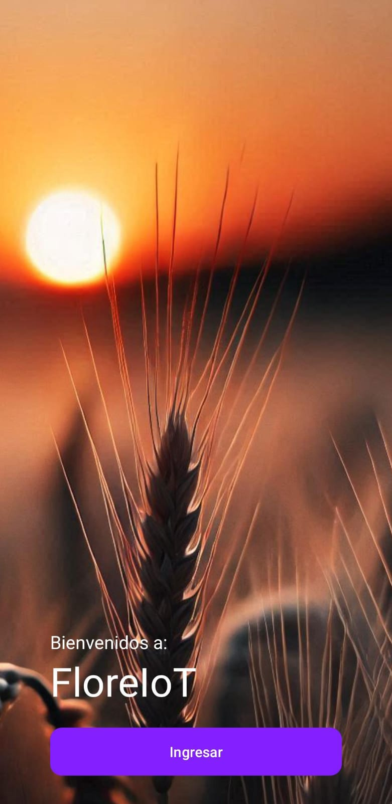
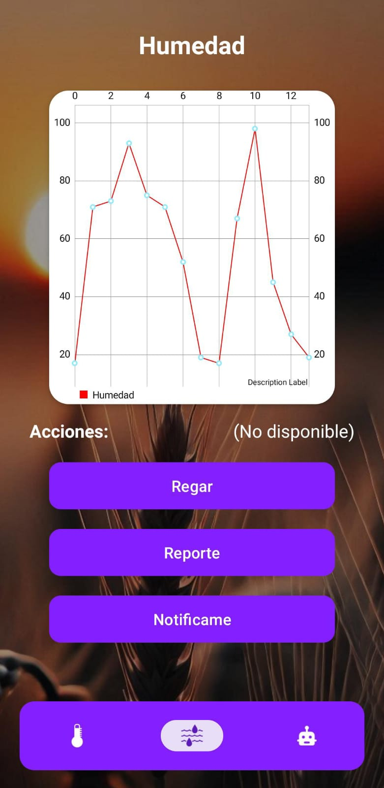

# FloreIoT 🌱💧


> 🚀 FloreIoT es una aplicación móvil nativa para Android que permite monitorear, automatizar y controlar sistemas de riego inteligente con ESP32 y sensores ambientales, ideal para agricultura, jardines y proyectos de domótica.

FloreIoT centraliza la información de temperatura y humedad, permite la gestión remota y automática del riego, y ofrece una experiencia visual moderna y profesional.

## 📋 Tabla de Contenidos

1. [Visión del Proyecto](#-visión-del-proyecto)
2. [🌟 Características Principales](#-características-principales)
3. [🛠️ Stack Tecnológico](#️-stack-tecnológico)
4. [📱 Vistazo a la App](#-vistazo-a-la-app)
5. [🚀 Puesta en Marcha (Instalación)](#-puesta-en-marcha-instalación)
6. [🤝 Contribuciones](#-contribuciones)
7. [📄 Licencia](#-licencia)

## 🎯 Visión del Proyecto

FloreIoT nace para facilitar la gestión eficiente del riego en entornos agrícolas y domésticos, optimizando el uso del agua y mejorando la salud de las plantas mediante la automatización y el monitoreo en tiempo real.

## 🌟 Características Principales

- **Monitoreo en tiempo real:** Visualización gráfica de temperatura y humedad.
- **Automatización:** Configuración de umbrales para activar el riego automático.
- **Control manual:** Activa el riego desde la app ante cualquier eventualidad.
- **Historial y reportes:** Consulta de registros históricos y reportes de riego.
- **Notificaciones:** Alertas sobre condiciones críticas o acciones automáticas.
- **Interfaz moderna:** Diseño profesional y responsivo con Material Design.

## 🛠️ Stack Tecnológico

- **Lenguaje Principal:** Kotlin
- **UI:**
  - Material Design 3
  - MPAndroidChart (gráficas)
- **Backend:**
  - Firebase Realtime Database
- **Hardware:**
  - ESP32 (sensores de humedad y temperatura, control de válvula)
- **Otras librerías:**
  - Glide (imágenes)
  - Google Material Components

## 📱 Vistazo a la App

| Pantalla de Bienvenida | Gráfica de Temperatura | Gráfica de Humedad |
| :---: | :---: | :---: |
|  |  |  |

> *Puedes personalizar y agregar más capturas en la carpeta `assets/` del repositorio.*

## 🚀 Puesta en Marcha (Instalación)

1. Clona este repositorio:
   ```bash
   git clone https://github.com/gaguilarf/FloreIoT.git
   ```
2. Abre el proyecto en Android Studio.
3. Configura Firebase siguiendo la documentación interna (`google-services.json`).
4. Compila y ejecuta la app en un dispositivo físico o emulador.

## 🤝 Contribuciones

¡Las contribuciones son bienvenidas! Abre un issue o pull request para sugerencias, mejoras o correcciones.

## 📄 Licencia

Este proyecto está bajo la licencia MIT. Consulta el archivo LICENSE para más detalles.

---

Desarrollado por el equipo de FloreIoT.
